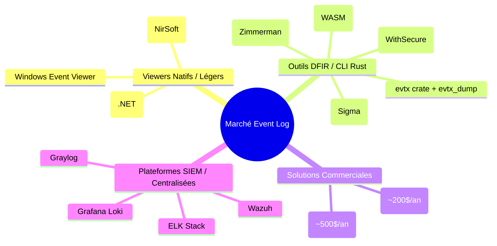
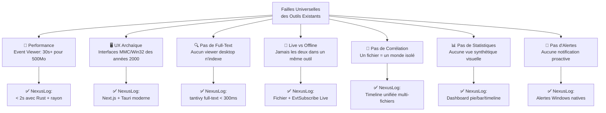

# 🔬 Analyse Approfondie — NexusLog (NexusLog)

> **Objectif** : Identifier les faiblesses exploitables des outils existants et les axes d'amélioration stratégiques pour positionner NexusLog comme la référence open source.

---

## 1. Cartographie Concurrentielle Complète

### 1.1 Catégorisation du marché

Le marché des outils d'analyse de Windows Event Logs se divise en **4 segments distincts** :



> [!IMPORTANT]
> **NexusLog se positionne dans un créneau unique** : il combine la rapidité des outils CLI Rust avec une GUI desktop native moderne. **Aucun concurrent n'occupe cette niche exacte.**

---

### 1.2 Analyse détaillée des concurrents directs

#### 🔴 Windows Event Viewer (natif Microsoft)

| Aspect | Évaluation | Détails |
|:---|:---:|:---|
| **Performance** | ❌ Très faible | 30+ sec pour charger un fichier de 500 Mo |
| **Interface** | ❌ Archaïque | Basée sur MMC, inchangée depuis Windows 2000 |
| **Filtres** | ❌ Basiques | Pas d'opérateurs logiques imbriqués, XPath brut uniquement |
| **Recherche** | ❌ Absente | Aucune recherche full-text sur les données d'événements |
| **Export** | ❌ Limité | Uniquement `.evtx` ou texte brut, pas de JSON/CSV propre |
| **Corrélation** | ❌ Absente | Un seul fichier/canal à la fois |
| **Extensibilité** | ❌ Nulle | Fermé, non scriptable, non extensible |

**Points faibles exploitables par NexusLog :**
- Performance 10-15x supérieure (Rust + rayon)
- UI moderne vs interface MMC des années 2000
- Recherche full-text (tantivy) — fonctionnalité totalement absente
- Export JSON/CSV/JSONL natif

---

#### 🟡 EventLook (open source, .NET 8)

| Aspect | Évaluation | Détails |
|:---|:---:|:---|
| **Performance** | 🟡 Correcte | Plus rapide que l'Event Viewer natif, mais limité par .NET |
| **Interface** | ✅ Moderne | UI simplifiée, bien conçue |
| **Filtres** | 🟡 Basiques | Filtrage par clic droit, exclusion d'EventID |
| **Recherche** | ❌ Absente | Pas de full-text search |
| **Export** | 🟡 CSV seul | Pas de JSON, pas de JSONL |
| **Mode Live** | ✅ Auto-refresh | Mais pas de vrai streaming temps réel |
| **Corrélation** | ❌ Absente | Pas de multi-fichiers |
| **Fuseaux horaires** | ✅ Bon | Ajustement timezone pour fichiers exportés |

**Points faibles exploitables par NexusLog :**
- Dépendance .NET 8 vs binaire natif Rust < 15 Mo
- Pas de recherche full-text
- Pas de corrélation multi-fichiers
- Pas d'alertes ni de statistiques visuelles
- Performance Rust nettement supérieure à .NET pour le parsing

---

#### 🟡 FullEventLogView (NirSoft, freeware)

| Aspect | Évaluation | Détails |
|:---|:---:|:---|
| **Performance** | 🟡 Moyenne | Charge tout en mémoire, problèmes sur gros fichiers |
| **Interface** | 🟡 Fonctionnelle | Style NirSoft classique (Win32), pas moderne |
| **Filtres** | 🟡 Tabulaires | Filtrage de colonnes basique |
| **Recherche** | ❌ Limitée | Recherche texte simple, pas d'indexation |
| **Export** | ✅ Multiple | CSV, HTML, XML, texte |
| **Mode Live** | ❌ Non | Pas de surveillance temps réel |
| **Corrélation** | ❌ Non | Fichier unique |

**Points faibles exploitables par NexusLog :**
- Interface Win32 vieillissante
- Pas de virtualisation → lag sur gros volumes
- Pas de mode live
- Code source fermé (freeware, pas open source)
- Susceptible aux bugs de l'API Windows Event Log (cache de métadonnées incorrect)

---

#### 🟢 EVTX Web (omerbenamram, WASM)

> [!WARNING]
> **C'est le concurrent le plus dangereux.** Il utilise la même crate `evtx` en Rust, compilée en WASM, avec DuckDB-WASM pour le filtrage et du virtual scrolling. Il est le plus proche techniquement d'NexusLog.

| Aspect | Évaluation | Détails |
|:---|:---:|:---|
| **Performance** | ✅ Excellente | Rust/WASM multi-thread, parsing rapide |
| **Interface** | ✅ Moderne | Thème clair/sombre, virtual scrolling |
| **Filtres** | ✅ Faceted | DuckDB-WASM, filtrage SQL en temps réel |
| **Recherche** | ✅ Full-text | Recherche intégrée |
| **Export** | ✅ JSON/XML | Export des données filtrées |
| **Privacy** | ✅ 100% local | Aucune donnée ne quitte le navigateur |
| **Mode Live** | ❌ Impossible | WASM ne peut pas accéder aux API Windows |
| **Corrélation** | ❌ Limitée | Pas de timeline multi-fichiers avancée |
| **Alertes** | ❌ Absentes | Pas de système de notification |
| **Installation** | 🟡 Web only | Pas d'app desktop native, dépend du navigateur |

**Points faibles exploitables par NexusLog :**
- ❌ **Pas de mode Live** — WASM ne peut pas appeler `EvtSubscribe` (API Windows native). C'est LA faiblesse majeure.
- ❌ **Pas d'alertes** — Pas de notifications système natives
- ❌ **Pas une vraie app desktop** — Pas de raccourcis clavier systèmes, pas d'icône tray, pas d'intégration OS
- ❌ **Limité par le navigateur** — Restrictions mémoire, pas d'accès filesystem direct
- ❌ **Pas de corrélation avancée** multi-fichiers avec timeline unifiée
- ❌ **Pas d'intégration Sigma** pour le threat hunting

---

#### 🟡 Hayabusa (Yamato Security, Rust CLI)

| Aspect | Évaluation | Détails |
|:---|:---:|:---|
| **Performance** | ✅ Excellente | Rust multi-thread |
| **Sigma Support** | ✅ Natif complet | Meilleure implémentation Sigma |
| **Timeline** | ✅ Forte | Génération de timelines forensiques |
| **GUI** | ❌ Aucune | CLI uniquement, nécessite Timeline Explorer pour visualiser |
| **Accessibilité** | ❌ Expert only | Courbe d'apprentissage très élevée |
| **Faux positifs** | 🟡 Fréquents | Règles Sigma nécessitent un tuning continu |

**Points faibles exploitables par NexusLog :**
- **Aucune interface graphique** — Le point faible majeur
- Sortie nécessite des outils tiers (Timeline Explorer) pour être exploitable
- Formats de sortie complexes, difficiles à ingérer dans d'autres systèmes
- Pas de mode interactif ni de live monitoring

---

#### 🟡 Chainsaw (WithSecure Labs, Rust CLI)

| Aspect | Évaluation | Détails |
|:---|:---:|:---|
| **Performance** | ✅ Excellente | Rust optimisé, triage rapide |
| **Cible** | ✅ First response | Triage rapide et ciblé |
| **Artefacts** | ✅ Multiple | Shimcache, SRUM en plus des EVTX |
| **GUI** | ❌ Aucune | CLI uniquement |
| **Breadth** | 🟡 Ciblé | Excellent pour le triage, moins complet pour l'analyse en profondeur |

**Points faibles exploitables par NexusLog :**
- Aucune GUI
- Orienté triage rapide, pas conçu pour l'exploration interactive
- Pas de live monitoring

---

#### 🔴 EventLog Explorer (Commercial, ~200$/an)

| Aspect | Évaluation | Détails |
|:---|:---:|:---|
| **Features** | ✅ Riches | Fonctionnalités enterprise complètes |
| **Performance** | 🟡 Variable | Historiquement limité par le 32-bit |
| **Coût** | ❌ ~200$/an | Payant, barrière pour les individuels |
| **Complexité** | 🟡 Élevée | Courbe d'apprentissage notable |
| **Bugs API** | 🟡 Présents | Sensible aux bugs de cache de métadonnées Windows |

**Points faibles exploitables par NexusLog :**
- **Payant** vs NexusLog gratuit et open source
- Interface vieillissante par rapport aux standards 2026
- Dépendance aux API Windows avec leurs bugs connus
- Pas open source = pas de confiance pour les outils de sécurité

---

### 1.3 Matrice de Positionnement

| Fonctionnalité | Event Viewer | EventLook | FullEvent | EVTX Web | Hayabusa | Chainsaw | EventLog Explorer | **NexusLog** |
|:---|:---:|:---:|:---:|:---:|:---:|:---:|:---:|:---:|
| GUI Desktop Native | ✅ | ✅ | ✅ | ❌ | ❌ | ❌ | ✅ | ✅ |
| Performance Ultra | ❌ | 🟡 | 🟡 | ✅ | ✅ | ✅ | 🟡 | ✅ |
| Recherche Full-Text | ❌ | ❌ | ❌ | ✅ | 🟡 | 🟡 | 🟡 | ✅ |
| Mode Live | ✅ | 🟡 | ❌ | ❌ | ❌ | ❌ | ✅ | ✅ |
| Corrélation Multi | ❌ | ❌ | ❌ | ❌ | ✅ | 🟡 | 🟡 | ✅ |
| Alertes Natives | ❌ | ❌ | ❌ | ❌ | ❌ | ❌ | 🟡 | ✅ |
| Open Source | ❌ | ✅ | ❌ | ✅ | ✅ | ✅ | ❌ | ✅ |
| Gratuit | ✅ | ✅ | ✅ | ✅ | ✅ | ✅ | ❌ | ✅ |
| Binaire Léger | - | 🟡 | ✅ | - | ✅ | ✅ | 🟡 | ✅ |
| Export JSON/CSV | ❌ | 🟡 | ✅ | ✅ | ✅ | ✅ | ✅ | ✅ |

> [!TIP]
> **Lecture clé** : NexusLog est le **seul outil** qui coche **toutes les cases vertes** simultanément. C'est votre proposition de valeur unique.

---

## 2. Analyse SWOT du Projet NexusLog

### Forces (Strengths)
- 🟢 **Stack technique optimal** : Rust + Tauri = performance native + UI moderne + binaire < 15 Mo
- 🟢 **Niche vide** : Aucun viewer EVTX Rust avec GUI desktop native n'existe
- 🟢 **Crate `evtx` prouvée** : 100% safe Rust, 14-17x plus rapide que Go
- 🟢 **Open source + Gratuit** : Avantage de confiance pour les outils de sécurité
- 🟢 **Mode Live unique** : Seule app open source moderne avec `EvtSubscribe` via GUI

### Faiblesses (Weaknesses)
- 🔴 **Projet embryonnaire** : Frontend vide, aucun code fonctionnel encore
- 🔴 **Dépendance Windows** : Tauri utilise WebView2, parfois absent sur vieux Windows 10
- 🔴 **Équipe réduite** : Roadmap ambitieuse (16 semaines) pour probablement une petite équipe
- 🔴 **Complexité WinAPI** : `EvtSubscribe` et les permissions UAC sont non-triviales à implémenter
- 🔴 **Pas d'intégration Sigma** : Absente de la roadmap, alors que c'est un standard DFIR

### Opportunités (Opportunities)
- 🔵 **Frustration massive** : L'Event Viewer natif n'a pas évolué depuis 20+ ans
- 🔵 **Communauté Rust** : r/rust adore les projets systèmes pratiques — viralité potentielle
- 🔵 **Marché DFIR en croissance** : Demande croissante d'outils forensiques rapides
- 🔵 **Monétisation Pro** : Marché prêt à payer 29-99$/an pour des features avancées
- 🔵 **Réseau de distribution** : winget, Chocolatey, GitHub + Hacker News pour le lancement

### Menaces (Threats)
- ⚠️ **EVTX Web est très avancé** : Il pourrait ajouter un wrapper Tauri et combler le gap
- ⚠️ **Antivirus/Faux positifs** : Les binaires Rust accédant aux WinAPI sont flaggés
- ⚠️ **Microsoft pourrait moderniser** l'Event Viewer (peu probable mais non-nul)
- ⚠️ **Hayabusa/Chainsaw** pourraient développer des GUI (risque communautaire)

---

## 3. Points Faibles Systémiques des Outils Existants

### 3.1 🎯 Failles Universelles (exploitables par NexusLog)



### 3.2 Gap critique : CLI ↔ GUI

> [!CAUTION]
> **Le gap le plus important du marché** : Les meilleurs outils de performance (Hayabusa, Chainsaw, evtx_dump) sont **CLI-only**, tandis que les meilleurs en UX (Event Viewer, EventLook) sont **lents et limités**.
>
> **NexusLog doit être le pont** : performance CLI Rust **+** ergonomie GUI moderne.

### 3.3 Bugs systémiques de l'API Windows Event Log

Tous les outils qui utilisent l'API Windows native (`EvtQuery`, `EvtRender`) partagent un bug documenté :
- **Cache de métadonnées incorrect** : Les "task categories" sont parfois mal résolues si les handles de métadonnées sont cachés de manière inappropriée
- **Impact** : Affichage de noms de tâches incorrects dans certaines builds Windows

**Avantage NexusLog** : En utilisant la crate `evtx` pour le mode fichier (parsing binaire direct, sans API Windows), NexusLog contourne ce bug. Le mode Live devra gérer ce problème spécifiquement.

---

## 4. Risques Techniques & Recommandations

### 4.1 Risques identifiés dans votre documentation

| # | Risque | Sévérité | Votre Mitigation | Mon Évaluation |
|---|:---|:---:|:---|:---|
| 1 | Faux positif antivirus | 🔴 Élevé | Signature code + soumission AV | ✅ Bon, mais **prévoir 200$/an** pour le certificat |
| 2 | EvtSubscribe nécessite admin | 🟡 Moyen | UAC prompt + doc | ✅ Suffisant, mais ajouter un **mode graceful degradation** |
| 3 | WebView2 absent | 🟡 Moyen | Bundler en option | ⚠️ **Tauri v2 l'installe automatiquement**, vérifier ce comportement |
| 4 | Perf insuffisante gros fichiers | 🔴 Élevé | Benchmarks Phase 0 | ✅ Mais ajouter du **lazy loading / streaming** |
| 5 | Breaking change API Windows | 🟡 Faible | Abstraction engine/ | ✅ Bonne architecture |
| 6 | Fragmentation canaux | 🟡 Moyen | Parser XML générique | ✅ Approche correcte |

### 4.2 Risques NON identifiés dans votre documentation

> [!WARNING]
> Les risques suivants ne figurent pas dans votre `Documentation.md` ni dans votre `Roadmap.md` mais sont critiques :

| # | Risque Manquant | Sévérité | Recommandation |
|---|:---|:---:|:---|
| 7 | **EVTX Web pourrait se wrapper en Tauri** et devenir un concurrent direct | 🔴 Élevé | Livrer le MVP rapidement, construire la communauté en premier |
| 8 | **Mémoire sur fichiers > 1 Go** — charger 1M+ records en RAM peut dépasser 2 Go | 🔴 Élevé | Implémenter un **mode streaming/pagination** dès la Phase 0 |
| 9 | **Absence de règles Sigma** dans la roadmap — standard DFIR incontournable | 🟡 Moyen | Ajouter le support Sigma en Phase 3 ou via plugin |
| 10 | **Cross-platform manquant** — Linux/Mac pour l'analyse hors-ligne de fichiers `.evtx` | 🟡 Moyen | La crate `evtx` est cross-platform ! Tauri aussi. Prévoir un mode "fichier seul" multiplateforme |
| 11 | **Accessibilité (a11y)** — aucune mention dans la doc | 🟡 Moyen | Prévoir les ARIA labels, le support clavier complet, le contraste accessible |
| 12 | **Localisation/i18n** manquante — limiter au seul anglais réduit l'adoption | 🟡 Faible | Prévoir une architecture i18n dès le frontend initial |

---

## 5. Recommandations Stratégiques Prioritées

### 🏆 Priorité 1 — Quick Wins (avantage immédiat vs concurrence)

#### A. Mode Live + Fichier dans un même outil
**Aucun outil open source gratuit** ne combine ces deux modes dans une GUI moderne. C'est votre **killer feature #1**.

#### B. Recherche Full-Text instantanée
Avec tantivy, vous offrez une capacité que **seul EVTX Web propose** parmi les viewers. Couplée à une app desktop native, c'est un avantage massif.

#### C. UI "WOW factor" dès le MVP
Les outils existants sont visuellement pauvres (Win32, MMC, CLI). Une interface Next.js avec :
- Dark mode par défaut
- Badges de niveau colorés avec animations subtiles
- Transitions fluides entre vues
- Virtual scrolling 60fps

...créera un **effet de contraste immédiat** avec la concurrence.

---

### 🥈 Priorité 2 — Différenciateurs Stratégiques (moyen terme)

#### D. Support Sigma Rules (manquant dans la roadmap)
Intégrer les [règles Sigma](https://github.com/SigmaHQ/sigma) permettrait de se positionner comme alternative GUI à Hayabusa. C'est un **game-changer pour le segment DFIR**.

#### E. Mode Cross-Platform pour fichiers .evtx
La crate `evtx` fonctionne sur Linux/Mac. Proposer un mode "analyse fichier uniquement" (sans Live) sur toutes les plateformes élargit massivement la base utilisateur, surtout pour les analystes DFIR qui travaillent souvent sur Mac/Linux.

#### F. Plugin d'intégration SIEM
Export direct vers ElasticSearch / Splunk / Timesketch en un clic. Les outils CLI le font en JSONL, mais aucune GUI ne propose cette intégration directe.

---

### 🥉 Priorité 3 — Vision Long Terme

#### G. Système de plugins
Permettre à la communauté d'étendre NexusLog (parseurs custom, règles de détection, intégrations). Aucun concurrent desktop ne propose cela.

#### H. Mode Collaboration / Équipe
Partage de profils de filtres, bookmarks d'événements, annotations — features enterprise absentes du marché open source.

---

## 6. Plan d'Action Révisé

Basé sur cette analyse, voici les ajustements recommandés à votre roadmap :

| Phase | Ajout Recommandé | Justification |
|:---|:---|:---|
| **Phase 0** | Ajouter un benchmark de mémoire pour fichiers > 1 Go | Risque #8 non couvert |
| **Phase 0** | Tester le mode cross-platform (Linux) dès le parser CLI | Élargissement de marché facile |
| **Phase 1** | Investir dans le design premium dès le MVP | Le "WOW factor" est le meilleur outil marketing |
| **Phase 1** | Ajouter l'i18n dès le scaffold frontend | Coût quasi nul si fait tôt, coûteux si ajouté tard |
| **Phase 2** | Implémenter le streaming/pagination pour gros fichiers | Éviter les OOM sur fichiers > 1 Go |
| **Phase 3** | **Ajouter le support Sigma Rules** | Différenciateur DFIR majeur absent de la roadmap |
| **Phase 3** | Prévoir le mode cross-platform dans le build | Linux/Mac pour l'analyse de fichiers hors-ligne |
| **Phase 4** | Soumission aux AV vendors **avant** la release | Risque critique de faux positifs |

---

## 7. Verdict Final

### Le positionnement gagnant d'NexusLog :

```
┌─────────────────────────────────────────────────────┐
│                                                     │
│   "La puissance de Hayabusa/Chainsaw (Rust CLI)     │
│    dans l'ergonomie d'une app desktop moderne       │
│    avec le Live monitoring de l'Event Viewer"       │
│                                                     │
│   = Un produit qui N'EXISTE PAS encore.             │
│                                                     │
└─────────────────────────────────────────────────────┘
```

### Forces à amplifier :
1. **Performance Rust** — Votre avantage technique fondamental
2. **Mode Live natif** — Votre avantage fonctionnel unique  
3. **GUI moderne** — Votre avantage UX face aux CLI et aux vieux viewers
4. **Open source** — Votre avantage de confiance dans le domaine de la sécurité

### Faiblesses à combler en urgence :
1. ⚠️ **Démarrer le code** — La documentation est excellente mais le `frontend/` est vide
2. ⚠️ **Sigma Rules** — Ajoutez-le à la roadmap Phase 3
3. ⚠️ **Gestion mémoire** — Prévoyez le streaming pour fichiers > 1 Go
4. ⚠️ **Cross-platform** — Facile à obtenir avec Rust/Tauri, ne pas l'ignorer

> [!TIP]
> **Conseil stratégique final** : Votre plus grand risque n'est pas technique — c'est la **rapidité d'exécution**. EVTX Web est activement développé et pourrait ajouter un wrapper Tauri à tout moment. Le premier à livrer un MVP fonctionnel avec mode Live gagne le marché. **Priorisez Phase 0 + Phase 1 en 4 semaines maximum.**
